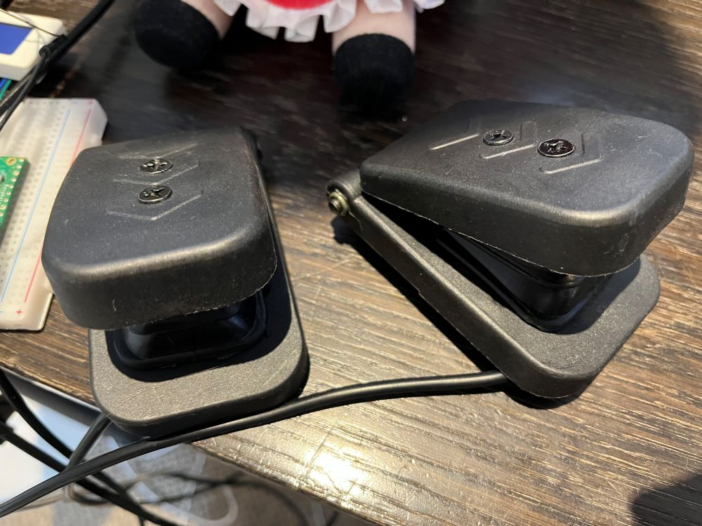
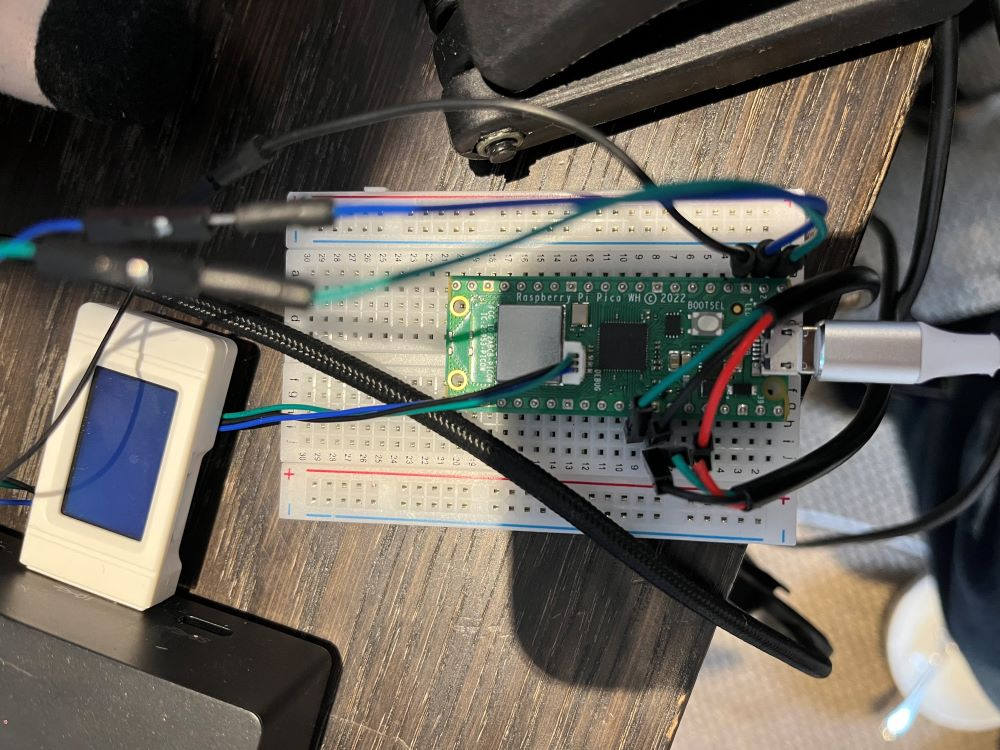

A very cheap way to add pedals to your PC using a rasbery pi pico.  

   

   

For debugging setup uart to GP1 and GP2.  

Pedals use GP28 and GP27 with 3V3(OUT) and GRD.  

The pedals used: https://www.aliexpress.com/item/1005006237335083.html?spm=a2g0o.order_list.order_list_main.5.4e801802ZqldFa  

Tested on a pico W and on American / Euro Truck Simulator.  

The pedals will show up as "Pico Pedals".  

Setup the controllols like so in American / Euro Trick Simulator.  

  

Could be addapted to other games, pedals and picos.  

### Setup  
1. Connect pedal cables to:  
GRD 3V3 GP27  
GRD 3V3 GP28  
  
2. For Debugging (Optional)  
2.1 Connect uart to GP1 GP2 GRD  

3. Open project in VSCode  
4. Install Rasberry Pi Pico Extension
  
5. Using The extension:  
  5.1. Compile Project  
  5.2. Flash Project  
